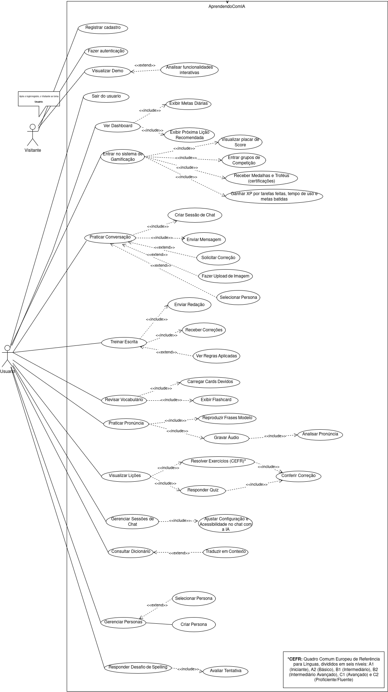
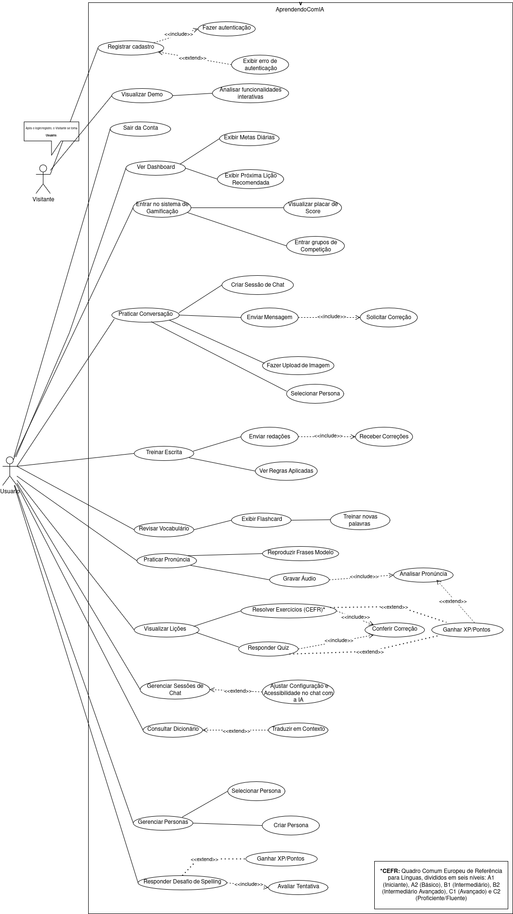

# Diagrama de Caso de Uso

---

## Sumário
- [Técnica Utilizada](#técnica-utilizada)
- [Objetivos](#objetivos)
- [Bibliografia](#bibliografia)
- [Histórico de Versões](#histórico-de-versões)

---

## Técnica Utilizada

 A técnica consiste em descrever detalhadamente as interações entre um "ator" (um usuário ou sistema externo) e o sistema em desenvolvimento para que este ator atinja um objetivo específico. Essencialmente, um caso de uso captura "uma sequência de ações que um sistema executa e que produzem um resultado observável de valor para um ator particular". Esta abordagem, consolidada por Ivar Jacobson como parte da UML (Unified Modeling Language), representa uma mudança de paradigma: em vez de listar funcionalidades de forma abstrata, ela as contextualiza em narrativas de uso.

A força da técnica reside na sua especificação textual detalhada, que vai muito além de simples diagramas. Uma especificação de caso de uso bem elaborada é um documento rico que contém:

* **Atores:** Entidades que interagem com o sistema. Podem ser **atores primários**, que iniciam a interação para atingir um objetivo (ex: um 'Aluno' em um app de idiomas), ou **atores secundários**, que o sistema utiliza para completar a tarefa (ex: um 'Sistema de Pagamento' ou um 'Serviço de Reconhecimento de Voz').
* **Pré-condições:** O estado que o sistema deve assumir para que o caso de uso possa ser iniciado. Ex: para o caso de uso "Realizar Lição Avançada", a pré-condição poderia ser "O usuário deve estar autenticado no sistema E já ter completado todas as lições do nível básico".
* **Pós-condições:** O estado do sistema após a conclusão bem-sucedida (ou não) do caso de uso. Ex: "O progresso do usuário é salvo E a próxima lição é desbloqueada" (sucesso) ou "O progresso da lição não é salvo" (falha).
* **Fluxo Principal (ou Básico):** A sequência de passos ideal, o "caminho feliz" onde tudo ocorre como esperado e o ator atinge seu objetivo sem desvios.
* **Fluxos Alternativos:** Sequências de passos secundárias e legítimas que também permitem que o ator atinja seu objetivo, mas por um caminho diferente. Ex: em um e-commerce, o fluxo principal é pagar com cartão de crédito, enquanto um fluxo alternativo seria "Pagar com boleto bancário".
* **Fluxos de Exceção:** Sequências que descrevem o que acontece quando algo dá errado e o objetivo do ator não pode ser alcançado. Ex: "O sistema de pagamento recusa a transação; o sistema informa o erro ao usuário e oferece a opção de tentar novamente com outro cartão".

Essa abordagem estruturada transforma requisitos vezes muito abstratos em um roteiro claro para designers, desenvolvedores e testadores, minimizando ambiguidades e desalinhamentos.

Fonte: [Letícia Monteiro](https://github.com/LeticiaMonteiroo), [Luiz Soares](https://github.com/luizh-gsoares), [Leonardo Lima](https://github.com/leozinlima), [Samuel Santos](https://github.com/SamuelAfonso),  2025.

## Segunda Versão 

Outra versão do mesmo documento de casos de uso mas agora usando o entendimento das linhas de uma maneira diferente.

Fonte: [Letícia Monteiro](https://github.com/LeticiaMonteiroo), [Luiz Soares](https://github.com/luizh-gsoares), [Leonardo Lima](https://github.com/leozinlima), [Samuel Santos](https://github.com/SamuelAfonso),  2025.

## Objetivos 

Os principais objetivos da utilização da técnica de casos de uso vão além da simples documentação e servem como pilares estratégicos no ciclo de vida do desenvolvimento.

1.  **Capturar Requisitos Funcionais com Precisão:** O objetivo primário é descrever *o que* o sistema deve fazer do ponto de vista do usuário. Essa visão externa garante que o esforço de desenvolvimento se concentre em funcionalidades que entregam valor real. Em aplicativos de aprendizado de idiomas como **Duolingo**, **Babbel** ou **ELSA Speak**, casos de uso descreveriam com detalhes interações como "Realizar uma lição de vocabulário", "Praticar pronúncia com feedback de IA" ou "Participar de um desafio comunitário". Um estudo comparativo (como os encontrados no portal **Language in India**) poderia informar os requisitos para adaptar essas funcionalidades a diferentes contextos culturais e linguísticos.

2.  **Estabelecer um Contrato Claro de Comunicação:** A engenharia de software é, em sua essência, um exercício de comunicação e aprendizado. Casos de uso servem como um "contrato" entre os stakeholders e a equipe técnica. Ao validar e aprovar um caso de uso, todos concordam sobre o comportamento esperado do sistema. Isso evita o clássico problema do "telefone sem fio" nos projetos.

3.  **Gerenciar a Complexidade e Priorizar o Escopo:** Em sistemas grandes, a quantidade de requisitos pode ser esmagadora. Casos de uso permitem decompor o sistema em partes gerenciáveis. É possível priorizar os casos de uso mais críticos para o negócio e planejar entregas incrementais. Ivar Jacobson reforça esta ideia:

---

## Bibliografia

- [Duolingo – Wikipedia](https://en.wikipedia.org/wiki/Duolingo)  
- [Babbel – Site Oficial](https://www.babbel.com/)  
- [ELSA Speak – Site Oficial](https://elsaspeak.com/en/)  
- [Language in India – Comparative Study](https://www.languageinindia.com/oct2024/drsunandauseAIEnglishlearning1.pdf)  
- [Sciedupress – Teaching with Apps](https://www.sciedupress.com/journal/index.php/jct/article/download/25589/16050)  
- [Arxiv – Gamification Misuse](https://arxiv.org/abs/2203.16175)  
- [SWEBOK – IEEE](https://www.computer.org/education/bodies-of-knowledge/software-engineering)  
- [LGPD – Gov.br](https://www.gov.br/cidadania/pt-br/acesso-a-informacao/lgpd)  
- [Sommerville – Engenharia de Software](https://www.pearson.com/en-us/subject-catalog/p/software-engineering/P200000003546/9780137035151)  
- [Miro – Arquitetura G3](https://miro.com/)  
- [Google Forms – Público Alvo](https://forms.gle/cB4qXso3j3tm2LVh6)

---

| Versão | Descrição | Autor(es) | Data de Produção | Revisor(es) | Data de Revisão | Incremento do Revisor |
| :----: | --------- | --------- | :--------------: | ----------- | :-------------: | :-------------------: |
| `1.0`  | Modelagem inicial | [Felipe das Neves](https://github.com/FelipeFreire-gf) | 12/09/2025 | [Samuel Afonso da Silva Santos](https://github.com/SamuelAfonso) | 21/09/2025| Revisão do Diagrama |
| `1.1`  | Adicionando Texto e as versãoes do Artefato | [Letícia Monteiro](https://github.com/LeticiaMonteiroo) | 21/09/2025 |   |  |  |