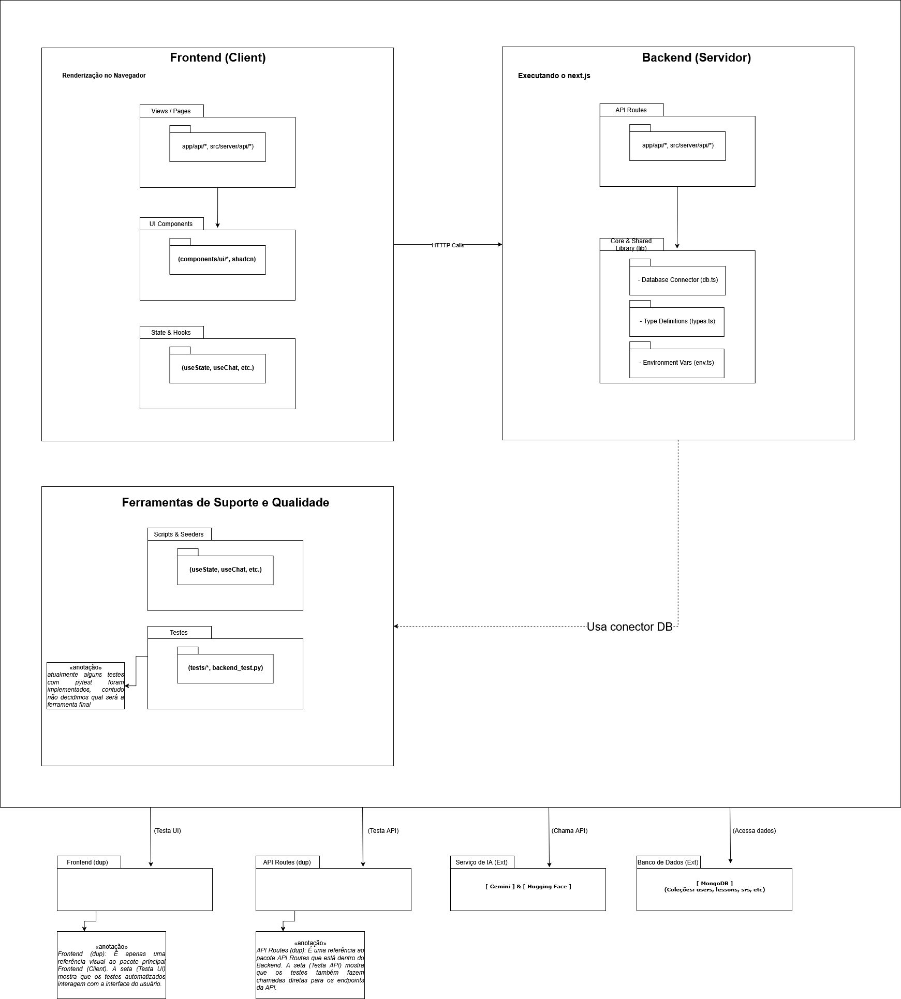

# Diagrama de Pacotes

---

## Técnica Utilizada

O Diagrama de Pacotes é um artefato da UML utilizado para organizar os elementos de um modelo em grupos, chamados pacotes. Ele simplifica diagramas complexos, mostrando uma visão de alto nível da arquitetura do sistema e as dependências entre seus principais componentes lógicos.

Segundo Sommerville¹, os diagramas de pacotes são usados para "organizar e apresentar diagramas de caso de uso ou de classes", ajudando a visualizar a estrutura modular de um sistema.

Neste artefato, utilizamos a ferramenta **Draw.io** para criar o diagrama.

## Objetivos

O objetivo deste diagrama é fornecer uma visão estrutural da arquitetura do sistema "Aprendendo com IA". De forma mais específica, busca-se:

- Organizar a arquitetura do sistema em pacotes lógicos e coesos.
- Visualizar as dependências entre as diferentes partes da aplicação (ex: Frontend, Backend, Serviços de IA).
- Facilitar o entendimento da estrutura geral do software, servindo como guia para a equipe de desenvolvimento.

---

## 3. Diagrama de Pacotes

O diagrama a seguir (Figura 1) ilustra a organização dos principais módulos do sistema "Aprendendo com IA" e como eles se relacionam.

<b>Figura 1:</b> Diagrama de Pacotes da aplicação.

<b>Autor:</b> <a href="https://github.com/FelipeFreire-gf">Felipe das Neves</a>
, <a href="https://github.com/gabriel-lima258">Gabriel Lima</a>  e <a href="https://github.com/MateuSansete">Mateus Bastos</a> 

---

## Bibliografia

> 1. SOMMERVILLE, Ian. **Engenharia de Software**. 10. ed. São Paulo: Pearson Education do Brasil, 2019.

---

## Histórico de Versões

| Versão | Descrição | Autor(es) | Data de Produção | Revisor(es) | Data de Revisão |
| :----: | --------- | --------- | :--------------: | ----------- | :-------------: |
| `1.0`  | Criação do documento e modelagem do Diagrama de Pacotes | Felipe das Neves | 14/09/2025 | | |
