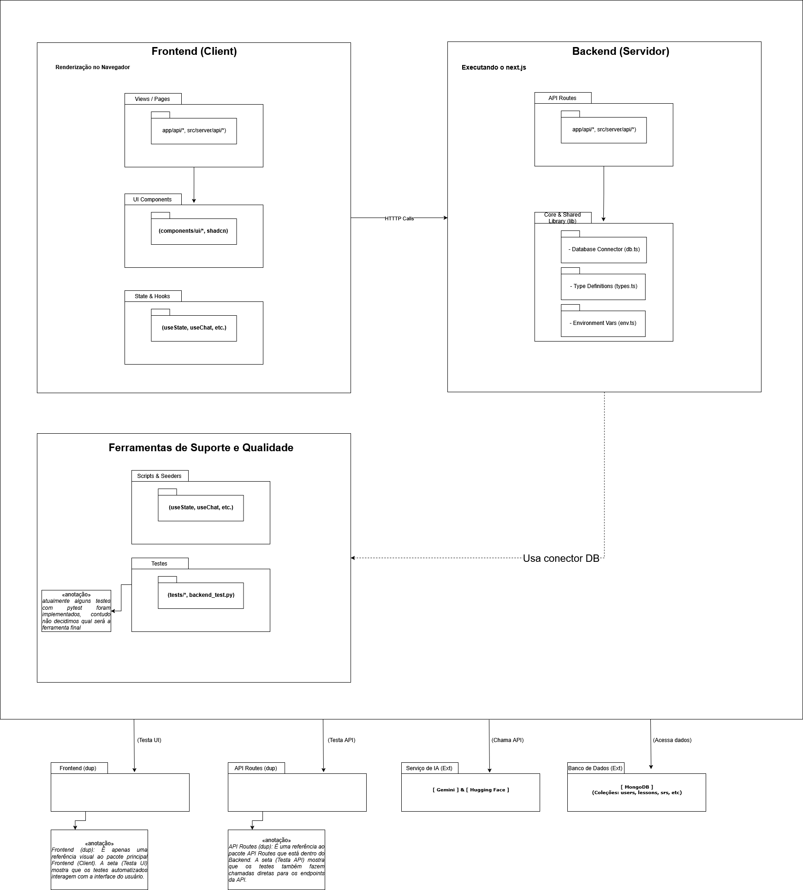

# Diagrama de Pacotes

---

## Sumário
- [Técnica Utilizada](#técnica-utilizada)
- [Objetivos](#objetivos)
- [Diagrama de Pacotes](#3-diagrama-de-pacotes)
- [Bibliografia](#bibliografia)
- [Histórico de Versões](#histórico-de-versões)

---

## Técnica Utilizada

O Diagrama de Pacotes é um artefato da UML utilizado para organizar os elementos de um modelo em grupos, chamados pacotes. Ele simplifica diagramas complexos, mostrando uma visão de alto nível da arquitetura do sistema e as dependências entre seus principais componentes lógicos.

Segundo Sommerville¹, os diagramas de pacotes são usados para "organizar e apresentar diagramas de caso de uso ou de classes", ajudando a visualizar a estrutura modular de um sistema.

Para a construção do diagrama, serão seguidas as etapas abaixo:

Serão analisados os seguintes artefatos para agrupamento e análise de informações:

- [Requisitos Funcionais e Não Funcionais elicitados](https://unbarqdsw2025-2-turma02.github.io/2025.2_T02_G3_AprendendoComIA_Entrega_01/#/iniciativasExtras/requisitosElicitados) - Elaborados na entrega 1;

- [Diagrama de Classe](modelagemEstatica/diagramaDeClasses.md);
- [Diagrama de Componentes](modelagemEstatica/diagramaDeComponentes.md);
- [Diagrama de Casos de Uso](ModelagemOrganizacional/diagramaDeCasoDeUso.md);

Após a análise dos dados, serão feitas as seguintes etapas:

Organização dos elementos identificados em pacotes temáticos.

Organização e compreensão das tependências entre os pacotes.

Neste artefato, utilizamos a ferramenta **Draw.io** para criar o diagrama.

## Objetivos

O objetivo deste diagrama é fornecer uma visão estrutural da arquitetura do sistema "Aprendendo com IA". De forma mais específica, busca-se:

- Organizar a arquitetura do sistema em pacotes lógicos e coesos.
- Visualizar as dependências entre as diferentes partes da aplicação (Frontend, Backend).
- Facilitar o entendimento da estrutura geral do software, servindo como guia para a equipe de desenvolvimento.

---

## 3. Diagrama de Pacotes

O diagrama a seguir (Figura 1) ilustra a organização dos principais módulos do sistema "Aprendendo com IA" e como eles se relacionam.

<b>Figura 1:</b> Diagrama de Pacotes da aplicação.

<b>Autor:</b> <a href="https://github.com/FelipeFreire-gf">Felipe das Neves</a>, <a href="https://github.com/gabriel-lima258">Gabriel Lima</a>  e <a href="https://github.com/MateuSansete">Mateus Bastos</a> 

---

## Bibliografia

> 1. SOMMERVILLE, Ian. **Engenharia de Software**. 10. ed. São Paulo: Pearson Education do Brasil, 2019.
> 2. APOSTILA UML. Seção sobre representação de Pacotes. Disponibilizada pela professora. Acesso em: 14 setembro  2025.
> 3. Diagrama de Pacotes: Definição, Componentes e Exemplos. Disponível em: https://gitmind.com/pt/diagrama-de-pacotes.html. Acesso em: 14 setembro 2025.
> 4. LUCIDCHART. Tudo sobre diagramas de pacotes UML. Disponível em: https://www.lucidchart.com/pages/pt/diagrama-de-pacotes-uml. Acesso em: 14 setembro  2025.
> 5. VISUAL PARADIGM. What is Package Diagram? Disponível em: https://www.visual-paradigm.com/guide/uml-unified-modeling-language/what-is-package-diagram/. Acesso em: 14 setembro  2025.
> 6. OLIVEIRA, Diego. Projeto de Desenvolvimento de Software – Aula 14: Diagrama de Pacotes. Disponível em: https://docentes.ifrn.edu.br/diegooliveira/disciplinas/pds/aula-14-diagrama-de-pacotes. Acesso em: 14 setembro  2025.

---

## Histórico de Versões

| Versão | Descrição | Autor(es) | Data de Produção | Revisor(es) | Data de Revisão | Incremento do Revisor |
| :----: | --------- | --------- | :--------------: | ----------- | :-------------: | :-------------------: |
| `1.0`  | Criação do documento e modelagem do Diagrama de Pacotes | [Felipe das Neves](https://github.com/FelipeFreire-gf), [Gabriel Lima](https://github.com/gabriel-lima258) e [Mateus Bastos](https://github.com/MateuSansete) | 14/09/2025 |  | |  |
| `1.1`  | Inserção dos elos | [Felipe das Neves](https://github.com/FelipeFreire-gf) | 21/09/2025 |  | |  |