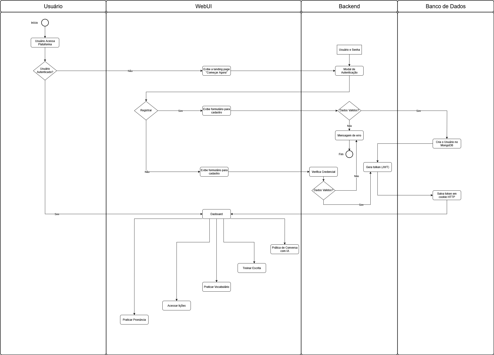
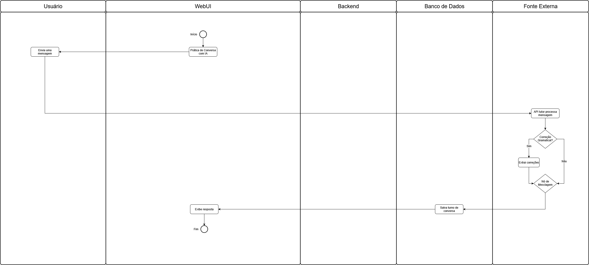
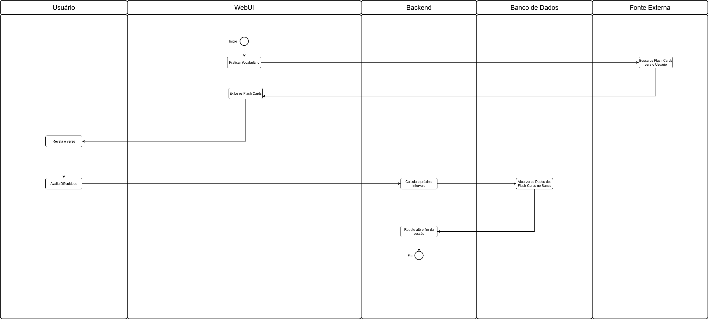
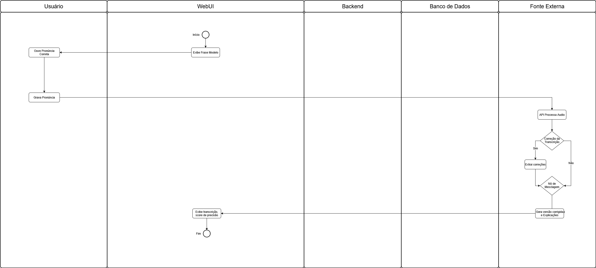
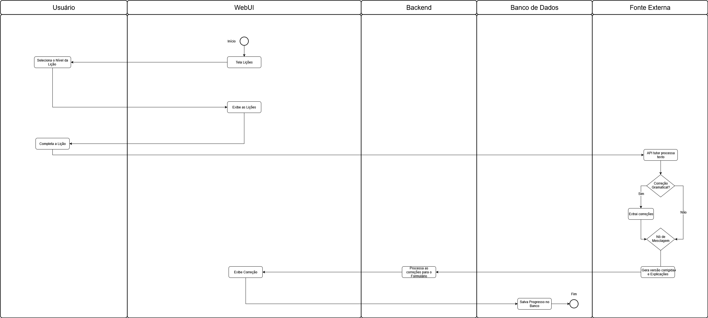

# Diagrama de Atividades

---

## 1. Técnica Utilizada

O Diagrama de Atividades é uma ferramenta da UML (Unified Modeling Language) utilizada para representar os fluxos de trabalho de um sistema, passo a passo. Ele é ideal para descrever a dinâmica de um processo, mostrando as ações executadas e as decisões que direcionam o fluxo.

Segundo Sommerville¹, os diagramas de atividade são eficazes para modelar o fluxo de controle entre diferentes operações, detalhando a sequência de ações e as condições que as governam. Eles são semelhantes a fluxogramas, mas com notações mais ricas para suportar concorrência e sincronização.

Neste artefato, utilizamos a notação do **draw.io** para criar os diagramas.

---

## 2. Objetivos

O objetivo deste documento é modelar as principais atividades desenvolvidas para a plataforma "Aprendendo com IA", evidenciando os fluxos funcionais e comportamentais do sistema. De forma mais específica, busca-se:

- Ilustrar os principais processos internos da plataforma, como o login e a realização de lições.
- Evidenciar os pontos de decisão, bifurcação e encerramento dos fluxos.
- Apoiar a modelagem comportamental dos casos de uso com uma representação visual clara e precisa.

---

## 3. Diagramas de Atividades

Foram elaborados seis diagramas de atividades para representar os fluxos mais importantes da interação do usuário com o sistema "Aprendendo com IA".

### 3.1. Diagrama de Atividades - Geral

O diagrama a seguir (Figura 1) descreve o fluxo que um novo usuário percorre para se cadastrar e, posteriormente, o fluxo de um usuário existente para realizar o login na plataforma. Além de mostrar as principais interfaces webUI da nossa aplicação.

<b>Figura 1:</b> Diagrama de Atividades para o fluxo de "Cadastro, login e navegação básica na aplicação".

<b>Autores:</b> <a href="https://github.com/FelipeFreire-gf">Felipe das Neves</a> e <a href="https://github.com/gabriel-lima258">Gabriel Lima</a>  

---

### 3.2. Diagrama de Atividades - Prática de Conversa com IA

Este diagrama (Figura 2) modela o fluxo de atividades que um usuário percorre ao realizar uma lição, desde a seleção até a conclusão, passando pela submissão de respostas, recebimento de feedback e atualização de seu progresso.

<b>Figura 2:</b> Diagrama de Atividades para o fluxo de "Realizar uma Lição".

<b>Autores:</b> <a href="https://github.com/FelipeFreire-gf">Felipe das Neves</a> e <a href="https://github.com/gabriel-lima258">Gabriel Lima</a>  

---

### 3.3. Diagrama de Atividades - Treinar Escrita

Este diagrama (Figura 2) modela o fluxo de atividades que um usuário percorre ao realizar uma lição, desde a seleção até a conclusão, passando pela submissão de respostas, recebimento de feedback e atualização de seu progresso.

<b>Figura 2:</b> Diagrama de Atividades para o fluxo de "Realizar uma Lição".

<b>Autores:</b> <a href="https://github.com/FelipeFreire-gf">Felipe das Neves</a> e <a href="https://github.com/gabriel-lima258">Gabriel Lima</a>  

---

### 3.4. Diagrama de Atividades - Práticar Vocabulário

Este diagrama (Figura 2) modela o fluxo de atividades que um usuário percorre ao realizar uma lição, desde a seleção até a conclusão, passando pela submissão de respostas, recebimento de feedback e atualização de seu progresso.

<b>Figura 2:</b> Diagrama de Atividades para o fluxo de "Realizar uma Lição".

<b>Autores:</b> <a href="https://github.com/FelipeFreire-gf">Felipe das Neves</a> e <a href="https://github.com/gabriel-lima258">Gabriel Lima</a>  

---

### 3.4. Diagrama de Atividades - Práticar Pronúncia

Este diagrama (Figura 2) modela o fluxo de atividades que um usuário percorre ao realizar uma lição, desde a seleção até a conclusão, passando pela submissão de respostas, recebimento de feedback e atualização de seu progresso.

<b>Figura 2:</b> Diagrama de Atividades para o fluxo de "Realizar uma Lição".

<b>Autores:</b> <a href="https://github.com/FelipeFreire-gf">Felipe das Neves</a> e <a href="https://github.com/gabriel-lima258">Gabriel Lima</a>  

---

### 3.4. Diagrama de Atividades - Acessar Lições

Este diagrama (Figura 2) modela o fluxo de atividades que um usuário percorre ao realizar uma lição, desde a seleção até a conclusão, passando pela submissão de respostas, recebimento de feedback e atualização de seu progresso.

<b>Figura 2:</b> Diagrama de Atividades para o fluxo de "Realizar uma Lição".

<b>Autores:</b> <a href="https://github.com/FelipeFreire-gf">Felipe das Neves</a> e <a href="https://github.com/gabriel-lima258">Gabriel Lima</a>  

---

## Bibliografia

> 1. SOMMERVILLE, Ian. **Engenharia de Software**. 10. ed. São Paulo: Pearson Education do Brasil, 2019.

---

## Histórico de Versões

| Versão | Descrição | Autor(es) | Data de Produção | Revisor(es) | Data de Revisão |
| :----: | --------- | --------- | :--------------: | ----------- | :-------------: |
| `1.0`  | Criação do documento e modelagem do diagrama de atividades para "Realizar Lição" | Felipe das Neves | 13/09/2025 | | |
| `1.1`  |  |  |  | | |
