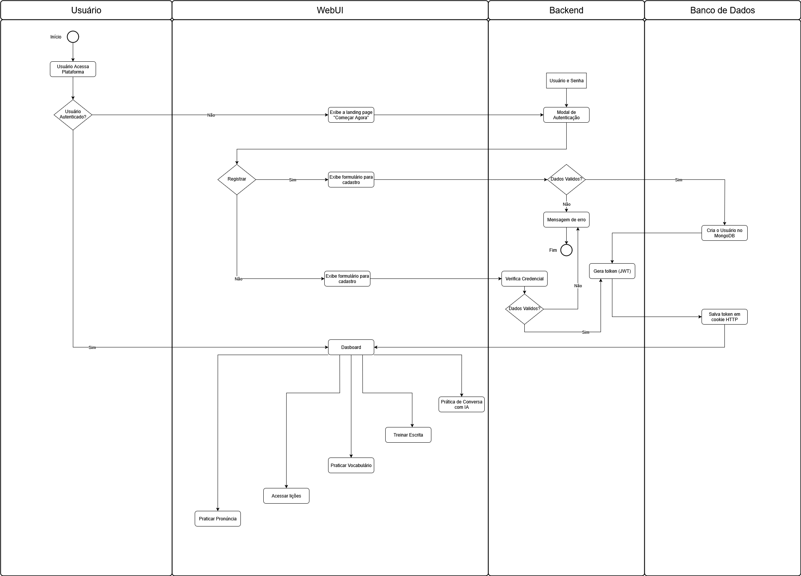
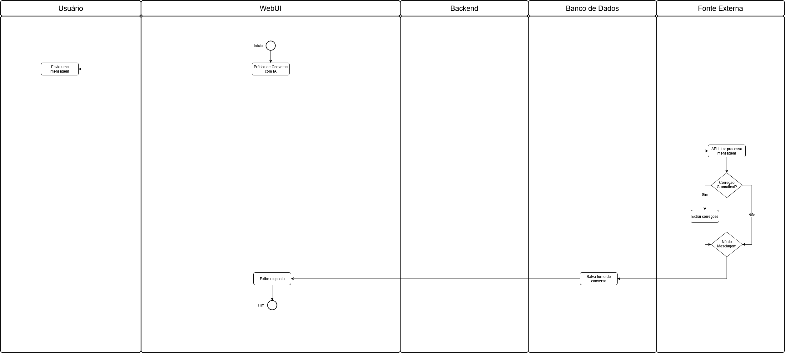
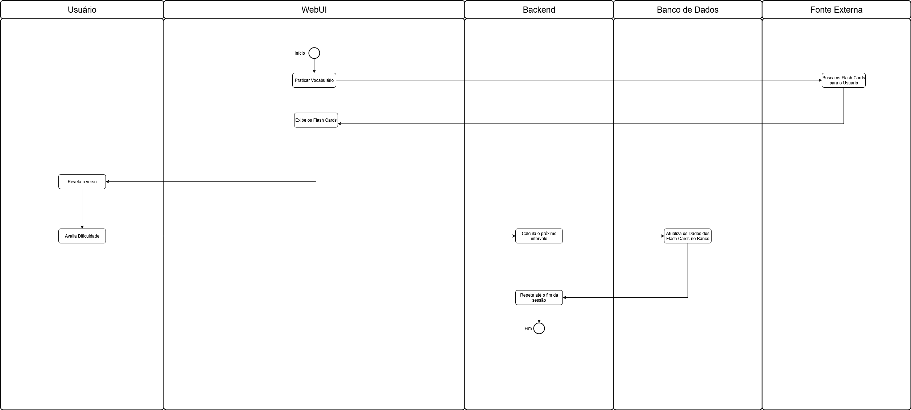
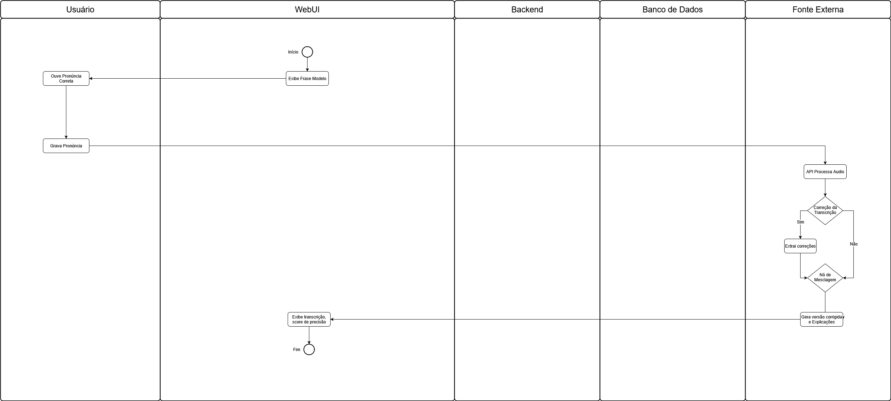
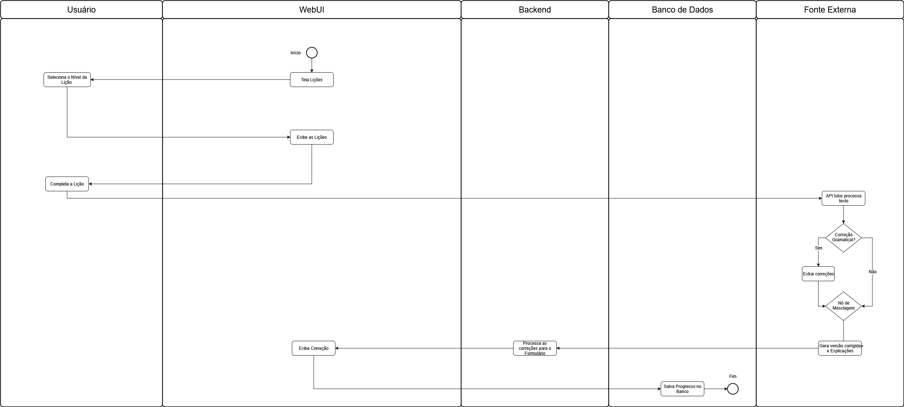

# Diagrama de Atividades

---

## Sumário
- [Técnica Utilizada](#técnica-utilizada)
- [Objetivos](#objetivos)
- [Diagramas de Atividades](#3-diagramas-de-atividades)
- [Bibliografia](#bibliografia)
- [Histórico de Versões](#histórico-de-versões)

---

## 1. Técnica Utilizada

O Diagrama de Atividades é uma ferramenta da UML (Unified Modeling Language) utilizada para representar os fluxos de trabalho de um sistema, passo a passo. Ele é ideal para descrever a dinâmica de um processo, mostrando as ações executadas e as decisões que direcionam o fluxo.

Segundo Sommerville¹, os diagramas de atividade são eficazes para modelar o fluxo de controle entre diferentes operações, detalhando a sequência de ações e as condições que as governam. Eles são semelhantes a fluxogramas, mas com notações mais ricas para suportar concorrência e sincronização.

Inicialmente serão realizadas análises dos seguintes artefatos:

- [Diagrama de Casos de Uso](../ModelagemOrganizacional/diagramaDeCasoDeUso.md);
- [Análise do Protótipo de Baixa Fidelidade](https://unbarqdsw2025-2-turma02.github.io/2025.2_T02_G3_AprendendoComIA_Entrega_01/#/designSprint/prototipacao) - Desenvolvido na Entrega 1;
- [Diagrama de Classes](../modelagemEstatica/diagramaDeClasses.md);
- [Diagrama de Componentes](../modelagemEstatica/diagramaDeComponentes.md);

Neste artefato, utilizamos a notação do **draw.io** para criar os diagramas.

---

## 2. Objetivos

O objetivo deste documento é modelar as principais atividades desenvolvidas para a plataforma "Aprendendo com IA", evidenciando os fluxos funcionais e comportamentais do sistema. De forma mais específica, busca-se:

- Ilustrar os principais processos internos da plataforma, como o login e a realização de lições.
- Evidenciar os pontos de decisão, bifurcação e encerramento dos fluxos.
- Apoiar a modelagem comportamental dos casos de uso com uma representação visual clara.

---

## 3. Diagramas de Atividades

Foram elaborados seis diagramas de atividades para representar os fluxos mais importantes da interação do usuário com o sistema "Aprendendo com IA".

### 3.1. Diagrama de Atividades - Geral

O diagrama a seguir (Figura 1) descreve o fluxo que um novo usuário percorre para se cadastrar e, posteriormente, o fluxo de um usuário existente para realizar o login na plataforma. Além de mostrar as principais interfaces webUI da nossa aplicação.

<b>Figura 1:</b> Diagrama de Atividades para o fluxo de "Cadastro, login e navegação básica na aplicação".

<b>Autores:</b> <a href="https://github.com/FelipeFreire-gf">Felipe das Neves</a> e <a href="https://github.com/gabriel-lima258">Gabriel Lima</a>  

---

### 3.2. Diagrama de Atividades - Prática de Conversa com IA

Este diagrama (Figura 2) modela o fluxo de atividades que um usuário percorre ao praticar a conversação com a IA, desde o início da interação até a conclusão, passando pela troca de mensagens, recebimento de feedback e atualização de seu progresso.

<b>Figura 2:</b> Diagrama de Atividades para o fluxo de "Prática de Conversa com IA".

<b>Autores:</b> <a href="https://github.com/FelipeFreire-gf">Felipe das Neves</a> e <a href="https://github.com/gabriel-lima258">Gabriel Lima</a>  

---

### 3.3. Diagrama de Atividades - Treinar Escrita

Este diagrama (Figura 3) modela o fluxo de atividades que um usuário percorre ao realizar um exercício de escrita, desde a seleção da atividade até a submissão do texto, recebimento de correções e atualização de seu progresso.

<b>Figura 3:</b> Diagrama de Atividades para o fluxo de "Treinar Escrita".

<b>Autores:</b> <a href="https://github.com/FelipeFreire-gf">Felipe das Neves</a> e <a href="https://github.com/gabriel-lima258">Gabriel Lima</a>  

---

### 3.4. Diagrama de Atividades - Práticar Vocabulário

Este diagrama (Figura 4) modela o fluxo de atividades que um usuário percorre ao praticar o vocabulário, como o uso de flashcards, desde o início do exercício até a sua conclusão e registro do desempenho.

<b>Figura 4:</b> Diagrama de Atividades para o fluxo de "Praticar Vocabulário".

<b>Autores:</b> <a href="https://github.com/FelipeFreire-gf">Felipe das Neves</a> e <a href="https://github.com/gabriel-lima258">Gabriel Lima</a>  

---

### 3.5. Diagrama de Atividades - Práticar Pronúncia

Este diagrama (Figura 5) modela o fluxo de atividades que um usuário percorre ao praticar sua pronúncia. O fluxo inclui a gravação da voz, o envio para análise da IA e o recebimento de feedback sobre a precisão.

<b>Figura 5:</b> Diagrama de Atividades para o fluxo de "Praticar Pronúncia".

<b>Autores:</b> <a href="https://github.com/FelipeFreire-gf">Felipe das Neves</a> e <a href="https://github.com/gabriel-lima258">Gabriel Lima</a>  

---

### 3.4. Diagrama de Atividades - Acessar Lições

Este diagrama (Figura 6) modela como um usuário navega pela plataforma para encontrar e selecionar uma lição específica para estudar, seja de vocabulário, escrita ou pronúncia.

<b>Figura 6:</b> Diagrama de Atividades para o fluxo de "Acessar Lições".

<b>Autores:</b> <a href="https://github.com/FelipeFreire-gf">Felipe das Neves</a> e <a href="https://github.com/gabriel-lima258">Gabriel Lima</a>  

---

# Legenda – Diagrama de Atividades

    

<b>Autor:</b> <a href="https://github.com/FelipeFreire-gf">Felipe das Neves</a> e <a href="https://github.com/gabriel-lima258">Gabriel Lima</a></a> 

---

## Bibliografia

> 1. SOMMERVILLE, Ian. **Engenharia de Software**. 10. ed. São Paulo: Pearson Education do Brasil, 2019.
> 2. APOSTILA UML. Unified Modeling Language – Linguagem de Modelagem Unificada em Português. Seção sobre diagrama de atividades. Disponibilizada pela professora. Acesso em: 14 set. 2025.
> 3. IBM. Diagramas de Atividades. Acesso em: 14 set. 2025.
> 4. LUCIDCHART. O que é diagrama de atividades UML?. Acesso em: 14 set. 2025.
> 5. BARCELAR, Ricardo. Engenharia de Software – Módulo 3: Modelagem de Sistemas Orientada a Objetos com UML. Disponibilizada pela professora. Acesso em: 14 set. 2025.
> 6. UML DIAGRAMS. UML Activity Diagram Controls. Acesso em: 14 set. 2025.

---

## Histórico de Versões

| Versão | Descrição | Autor(es) | Data de Produção | Revisor(es) | Data de Revisão | Incremento do Revisor |
| :----: | --------- | --------- | :--------------: | ----------- | :-------------: | :-------------------: |
| `1.0`  | Criação do documento | [Felipe das Neves](https://github.com/FelipeFreire-gf) | 12/09/2025 |  | |  |
| `1.1`  | Modelagem do Diagrama de Atividades | [Felipe das Neves](https://github.com/FelipeFreire-gf) e [Gabriel Lima](https://github.com/gabriel-lima258) | 14/09/2025 |  | |  |
| `1.2`  | Inserção dos elos | [Felipe das Neves](https://github.com/FelipeFreire-gf) | 21/09/2025 |  | |  |