# Diagrama de Estados

---

## Sumário
- [Técnica Utilizada](#técnica-utilizada)
- [Objetivos](#objetivos)
- [Bibliografia](#bibliografia)
- [Histórico de Versões](#histórico-de-versões)

---

## Técnica Utilizada
O **Diagrama de Estados** (State Machine Diagram) é um artefato da UML utilizado para representar o **comportamento dinâmico** de um sistema ou de seus componentes.  
Ele mostra os **estados possíveis** de um objeto e as **transições** entre eles, disparadas por eventos e acompanhadas de ações.  

Segundo Sommerville¹, os diagramas de estados permitem:  

> “Descrever como os sistemas reagem a eventos externos e internos, modelando o ciclo de vida de objetos e subsistemas”.  

### Etapas seguidas
1. Análise dos requisitos funcionais e não funcionais levantados.  
2. Identificação dos módulos com comportamento dinâmico (Autenticação, Chat, Tarefas, SRS, Quiz, Spelling, Social Rooms, Dicionário e Personas).  
3. Definição dos estados principais de cada módulo e eventos que disparam mudanças.  
4. Construção dos diagramas no padrão UML 2.5 (utilizando a ferramenta Mermaid e posterior exportação gráfica).  

---

## Objetivos
O objetivo deste diagrama é fornecer uma visão **clara e integrada do comportamento dinâmico** do sistema. Mais especificamente:  

- Representar os **estados internos** de cada módulo e como o usuário ou o sistema disparam transições.  
- Tornar explícito o **fluxo de execução** de funcionalidades (ex.: autenticação, submissão de tarefas, revisões no SRS).  
- Apoiar o processo de **validação de requisitos** e **entendimento da lógica do sistema** por parte da equipe de desenvolvimento e docentes.  

---

## Legenda

**Tabela 1 - Legenda do Diagrama de Estados**

| Legenda |    Representação    |
| :----: | :--------: |
| Estado incial | 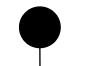 |
| Estado final | 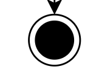 |
| Processo intermediario de escolha | 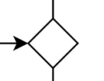 |
| Estado | 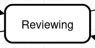 |

---

## 3.1 Diagrama de  Não Autenticado

A Figura 1 representa o estado geral do sistema, dividido entre estados "Não autenticado" e "Autenticado". O fluxo inicia no estado "Idle", onde o sistema aguarda as credenciais de login. Após o login, ele entra no estado "Logging in" e, se as credenciais forem válidas, transita para o estado "Dashboard" no fluxo "Autenticado", que centraliza todas as funcionalidades do usuário

<b>Figura 1:</b> Diagrama de Estados da aplicação.

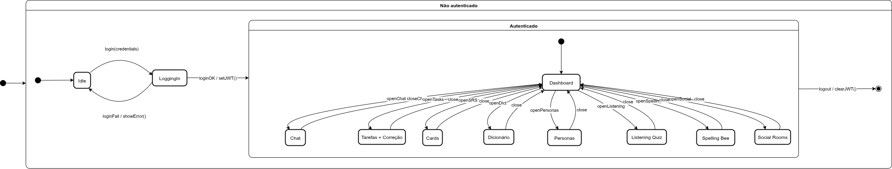

<b>Autor:</b> <a href="https://github.com/MateuSansete">Mateus Bastos</a>, <a href="https://github.com/leozinlima">Leonardo de Melo Lima</a> e <a href="https://github.com/luizh-gsoares">Luiz Henrique Soares</a> 

## 3.2 Diagrama de Estados Chat

A Figura 2 descreve o ciclo de vida da funcionalidade de Chat. O processo começa no estado "Ready", pronto para receber uma mensagem do usuário. Ao receber a mensagem, a sessão transita para "Running" enquanto o sistema a processa. Em seguida, a sessão pode entrar em estado "Blocked" (aguardando a resposta da IA) ou, se a conversa for encerrada, a sessão pode ser finalizada.

<b>Figura 2:</b> Diagrama de Estados da aplicação.

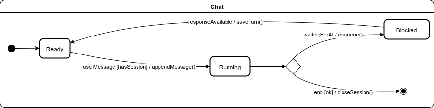

<b>Autor:</b> <a href="https://github.com/MateuSansete">Mateus Bastos</a>, <a href="https://github.com/leozinlima">Leonardo de Melo Lima</a> e <a href="https://github.com/luizh-gsoares">Luiz Henrique Soares</a> 

## 3.3 Diagrama de Estados Tarefas + Correção

A Figura 3 detalha o processo de Tarefas + Correção. O fluxo começa no estado "Browsing", onde o usuário navega e seleciona uma tarefa. Ao abrir uma tarefa, o estado muda para "Editing". Quando a tarefa é enviada, o sistema entra no estado "Submitting" e, em seguida, "WaitingCorr" (aguardando a correção). Se a correção for bem-sucedida, o estado final é "Corrected". Caso ocorra um erro, o fluxo desvia para o estado "Error", de onde o usuário pode tentar novamente.

<b>Figura 3:</b> Diagrama de Estados da aplicação.

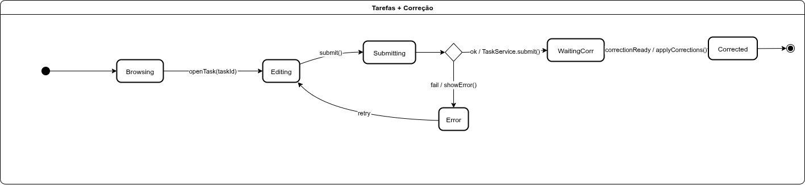

<b>Autor:</b> <a href="https://github.com/MateuSansete">Mateus Bastos</a>, <a href="https://github.com/leozinlima">Leonardo de Melo Lima</a> e <a href="https://github.com/luizh-gsoares">Luiz Henrique Soares</a> 

## 3.4 Diagrama de Estados Cards

A Figura 4 mostra o processo de estudo com cartões. O fluxo inicia no estado "Loading", onde o sistema busca os cartões que precisam ser revisados. A partir daí, há duas possibilidades: se não houver cartões para revisão, o fluxo vai para o estado final "NoDue"; se a lista não estiver vazia, o sistema entra em "Reviewing", onde o usuário revisa os cartões até que todos os cartões do lote tenham sido avaliados, finalizando o processo.

<b>Figura 4:</b> Diagrama de Estados da aplicação.

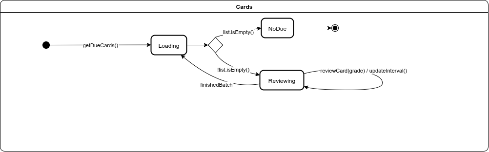

<b>Autor:</b> <a href="https://github.com/MateuSansete">Mateus Bastos</a>, <a href="https://github.com/leozinlima">Leonardo de Melo Lima</a> e <a href="https://github.com/luizh-gsoares">Luiz Henrique Soares</a> 

## 3.5 Diagrama de Estados Listening Quiz

A Figura 5 detalha o ciclo de um quiz de escuta. O processo começa em "Preparing", onde o quiz é criado. Quando a faixa estiver pronta, o estado muda para "Playing" e o áudio é reproduzido. Em seguida, o usuário entra em "Answering" para escolher uma opção. Após submeter, o sistema transita para "Grading" para avaliar a resposta. O resultado é então exibido no estado "Review", finalizando o quiz.

<b>Figura 5:</b> Diagrama de Estados da aplicação.

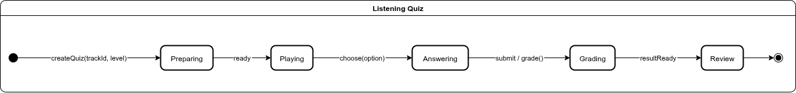

<b>Autor:</b> <a href="https://github.com/MateuSansete">Mateus Bastos</a>, <a href="https://github.com/leozinlima">Leonardo de Melo Lima</a> e <a href="https://github.com/luizh-gsoares">Luiz Henrique Soares</a> 

## 3.6 Diagrama de Estados Spelling Bee

A Figura 6 representa o fluxo do jogo de soletração. O fluxo começa no estado "Challenge", onde o sistema apresenta uma palavra para ser soletrada. O áudio da palavra é então reproduzido no estado "Listening". Em seguida, o usuário entra em "Typing" para digitar a palavra. Após submeter, o sistema entra em "Evaluating" para verificar se a palavra está correta. Por fim, o resultado é mostrado no estado "Result".

<b>Figura 6:</b> Diagrama de Estados da aplicação.

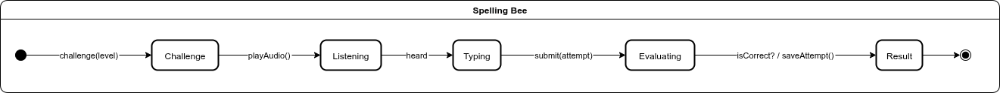

<b>Autor:</b> <a href="https://github.com/MateuSansete">Mateus Bastos</a>, <a href="https://github.com/leozinlima">Leonardo de Melo Lima</a> e <a href="https://github.com/luizh-gsoares">Luiz Henrique Soares</a> 

## 3.7 Diagrama de Estados Dicionário

A Figura 7 representa o fluxo de uso da funcionalidade de Dicionário. O processo começa no estado "Idle", aguardando a interação do usuário. A partir daí, o usuário pode escolher entre duas ações: buscar uma definição, entrando no estado "Searching", ou solicitar uma tradução, entrando em "Translating". Após a conclusão de qualquer uma dessas tarefas, o fluxo retorna ao estado "Idle", pronto para uma nova ação.

<b>Figura 7:</b> Diagrama de Estados da aplicação.

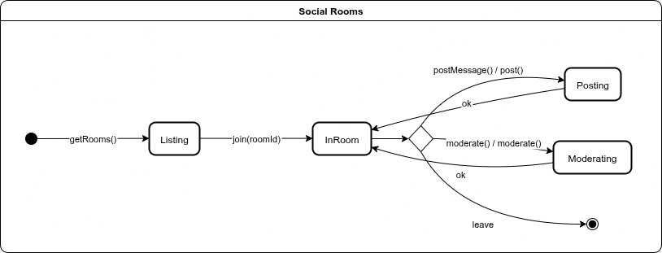

<b>Autor:</b> <a href="https://github.com/MateuSansete">Mateus Bastos</a>, <a href="https://github.com/leozinlima">Leonardo de Melo Lima</a> e <a href="https://github.com/luizh-gsoares">Luiz Henrique Soares</a> 

## 3.8 Diagrama de Estados Personas

A Figura 8 detalha o ciclo de vida da funcionalidade Personas. O fluxo se inicia no estado "Listing", onde as personas cadastradas são exibidas. Desse ponto, o usuário pode iniciar a "Edição" de uma persona, a "Criação" de uma nova ou "Anexar" uma persona a uma sessão de chat. Após qualquer uma dessas ações, o sistema retorna ao estado "Listing", atualizando a lista.

<b>Figura 8:</b> Diagrama de Estados da aplicação.

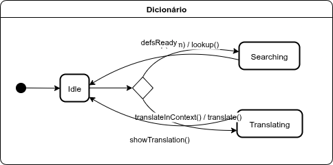

<b>Autor:</b> <a href="https://github.com/MateuSansete">Mateus Bastos</a>, <a href="https://github.com/leozinlima">Leonardo de Melo Lima</a> e <a href="https://github.com/luizh-gsoares">Luiz Henrique Soares</a> 

## 3.9 Diagrama de Estados Social Rooms

A Figura 9 mostra o processo de interação nas salas sociais. O fluxo começa no estado "Listing", onde as salas disponíveis são exibidas. Quando o usuário entra em uma sala, o estado muda para "InRoom". Dentro da sala, há três ações possíveis: o usuário pode "Postar" uma mensagem, um moderador pode "Moderar" o conteúdo ou o usuário pode "Sair" da sala, finalizando o processo.

<b>Figura 9:</b> Diagrama de Estados da aplicação.

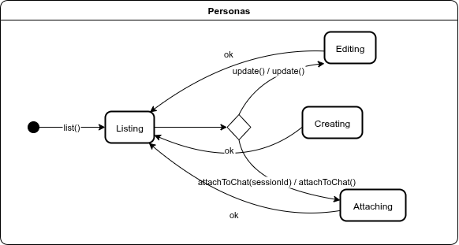

<b>Autor:</b> <a href="https://github.com/MateuSansete">Mateus Bastos</a>, <a href="https://github.com/leozinlima">Leonardo de Melo Lima</a> e <a href="https://github.com/luizh-gsoares">Luiz Henrique Soares</a> 

---

## Bibliografia

- [OMG UML 2.5.1 Specification – Object Management Group](https://www.omg.org/spec/UML/2.5.1/)  
- [UML State Machine Diagrams – UML Diagrams.org](https://www.uml-diagrams.org/state-machine-diagrams.html)  
- [The Unified Modeling Language User Guide – Addison-Wesley](https://www.amazon.com/Unified-Modeling-Language-User-Guide/dp/0321267974)  
- [UML Essencial: Um breve guia para a linguagem padrão de modelagem de objetos – Bookman](https://www.amazon.com.br/UML-Essencial-Breve-Linguagem-Modelagem/dp/8577800223)  
- [State Machine Diagram Tutorial – Visual Paradigm](https://www.visual-paradigm.com/guide/uml-unified-modeling-language/what-is-state-machine-diagram/)

---

## Histórico de Versões

| Versão | Descrição                                                        | Autor(es)                                              | Data de Produção | Revisor(es) | Data de Revisão | Incremento do Revisor |
| :----: | ---------------------------------------------------------------- | ------------------------------------------------------ | :--------------: | ----------- | :-------------: | :-------------------: |
|  `1.0` | Modelagem inicial | [Mateus Bastos](https://github.com/MateuSansete), [Leonardo de Melo Lima](https://github.com/leozinlima), [Luiz Henrique Soares](https://github.com/luizh-gsoares) |    21/09/2025    | [Mateus Bastos](https://github.com/MateuSansete) |                 |                       |
|  `1.1` | Inserção das descrições dos diagramas | [Mateus Bastos](https://github.com/MateuSansete), [Leonardo de Melo Lima](https://github.com/leozinlima), [Luiz Henrique Soares](https://github.com/luizh-gsoares) | 21/09/2025 | [Leonardo de Melo Lima](https://github.com/leozinlima) | 21/09/2025 | Revisão textual |
|  `1.2` | Ajustes no documento | [Mateus Bastos](https://github.com/MateuSansete), [Leonardo de Melo Lima](https://github.com/leozinlima) | 21/09/2025 | [Luiz Henrique Soares](https://github.com/luizh-gsoares) | 21/09/2025 | Padronização final |
|  `1.3` | Inserção dos diagramas | [Mateus Bastos](https://github.com/MateuSansete) | 21/09/2025 | [Leonardo de Melo Lima](https://github.com/leozinlima), [Luiz Henrique Soares](https://github.com/luizh-gsoares) | 21/09/2025 | Revisão dos diagramas |
