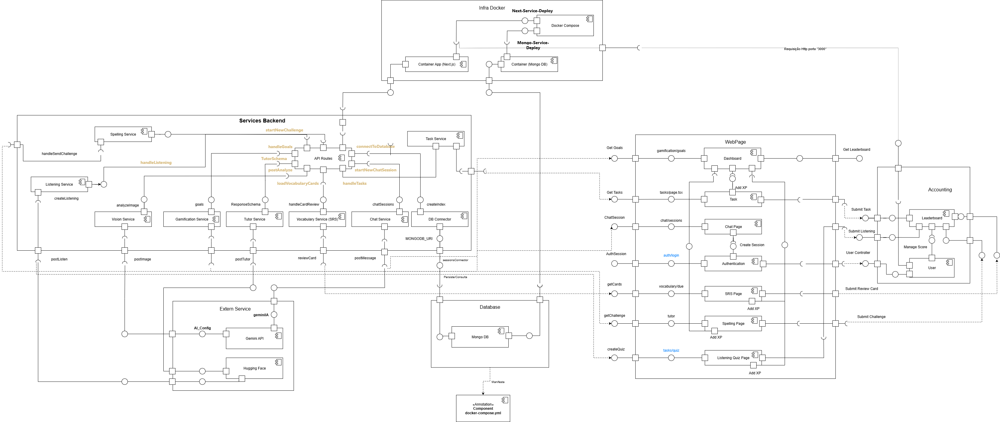

# Diagrama de Componentes

---

## Sumário
- [Técnica Utilizada](#técnica-utilizada)
- [Objetivos](#objetivos)
- [Diagrama de Componentes](#3-diagrama-de-componentes)
- [Bibliografia](#bibliografia)
- [Histórico de Versões](#histórico-de-versões)

--- 

## Técnica Utilizada

O Diagrama de Componentes é um artefato da UML que descreve a organização e as dependências entre os componentes de software de um sistema. Ele oferece uma visão de alto nível da arquitetura, mostrando como as partes do sistema (como bibliotecas, executáveis e arquivos) se conectam através de interfaces.

Segundo Sommerville¹, os diagramas de componentes são usados para "mostrar como um sistema de software é dividido em componentes e como esses componentes interagem entre si". Eles são úteis para o projeto da arquitetura do sistema e para a documentação da implementação.

Para a construção do diagrama, serão seguidas as etapas abaixo:

Serão analisados os seguintes artefatos para agrupamento e análise de informações:

- [Requisitos Funcionais e Não Funcionais elicitados](https://unbarqdsw2025-2-turma02.github.io/2025.2_T02_G3_AprendendoComIA_Entrega_01/#/iniciativasExtras/requisitosElicitados) - Elaborados na entrega 1;
- [Rich Picture](https://unbarqdsw2025-2-turma02.github.io/2025.2_T02_G3_AprendendoComIA_Entrega_01/#/artefatosGeneralistas/richPicture) - Elaborados na entrega 1;
- [Requisitos elicitados](https://unbarqdsw2025-2-turma02.github.io/2025.2_T02_G3_AprendendoComIA_Entrega_01/#/iniciativasExtras/requisitosElicitados) - Elaborados na entrega 1;
- [Protótipo de Baixa Fidelidade](https://unbarqdsw2025-2-turma02.github.io/2025.2_T02_G3_AprendendoComIA_Entrega_01/#/designSprint/prototipacao) - Elaborados na entrega 1;
- [Diagrama de Casos de Uso](ModelagemOrganizacional/diagramaDeCasoDeUso.md);
- [Diagrama de Classe](modelagemEstatica/diagramaDeClasses.md);

Após a análise dos dados, serão feitas as seguintes etapas:

1.  **Identificação dos Componentes:** Análise da arquitetura para definir os principais componentes do sistema (ex: Frontend, Backend, Banco de Dados, APIs externas).
2.  **Definição das Interfaces:** Especificação das interfaces que cada componente provê e requer para se comunicar com os outros.
3.  **Mapeamento das Dependências:** Estabelecimento das relações de dependência entre os componentes.

Neste artefato, utilizamos a ferramenta **Draw.io** para criar o diagrama.

---

## Objetivos

O objetivo deste diagrama é ilustrar a arquitetura de software do sistema "Aprendendo com IA", detalhando seus componentes e as relações entre eles. De forma mais específica, busca-se:

- Visualizar a estrutura modular do sistema.
- Identificar as principais tecnologias e serviços que compõem a aplicação.
- Facilitar o entendimento sobre como as diferentes partes do software interagem.

---

## 3. Diagrama de Componentes

O diagrama a seguir (Figura 1) ilustra a organização dos principais módulos do sistema "Aprendendo com IA" e como eles se relacionam.

<b>Figura 1:</b> Diagrama de Pacotes da aplicação.

<b>Autor:</b> <a href="https://github.com/FelipeFreire-gf">Felipe das Neves</a>, <a href="https://github.com/gabriel-lima258">Gabriel Lima</a>  e <a href="https://github.com/MateuSansete">Mateus Bastos</a> 

---

### Legenda – Diagrama de Componentes

    

<b>Autor:</b> <a href="https://github.com/FelipeFreire-gf">Felipe das Neves</a>, <a href="https://github.com/gabriel-lima258">Gabriel Lima</a>  e <a href="https://github.com/MateuSansete">Mateus Bastos</a> 

---

## Bibliografia

> 1. SOMMERVILLE, Ian. **Engenharia de Software**. 10. ed. São Paulo: Pearson Education do Brasil, 2019.
> 2. APOSTILA UML. Linguagem de Modelagem Unificada. Disponibilizado pela professora. Acesso em: 21 setembro. 2025.
> 3. UML DIAGRAMS. Component Diagrams Overview. Disponível em: https://www.uml-diagrams.org/component-diagrams.html. Acesso em: 21 setembro. 2025.
> 4. IBM CORPORATION. Component diagrams. IBM Documentation, 2023. Disponível em: https://www.ibm.com/docs/en/dmrt/9.5.0?topic=diagrams-component. Acesso em: 21 setembro. 2025.
> 5. LUCID SOFTWARE INC. UML Component Diagram. Lucidchart, 2024. Disponível em: https://www.lucidchart.com/pages/uml-component-diagram. Acesso em: 21 setembro. 2025.
> 6. VISUAL PARADIGM INTERNATIONAL. UML Component Diagram Guide. Visual Paradigm, 2024. Disponível em: https://www.visual-paradigm.com/guide/uml-unified-modeling-language/uml-component-diagram/. Acesso em: 21 setembro. 2025.
> 7. IBM CORPORATION. Diagrama de componentes. IBM Documentation. Disponível em: https://www.ibm.com/docs/pt-br/rsas/7.5.0?topic=services-component-diagrams. Acesso em: 21 setembro. 2025.
> 8. LUCID SOFTWARE INC. Diagrama de componentes UML. Lucidchart. Disponível em: https://www.lucidchart.com/pages/pt/diagrama-de-componentes-uml. Acesso em: 21 setembro. 2025.
> 9. CREATELY. Tutorial de Diagrama de Componentes UML. Disponível em: https://creately.com/blog/pt/diagrama/tutorial-de-diagrama-de-componentes-2/. Acesso em: 21 setembro. 2025.

---

## Histórico de Versões

| Versão | Descrição | Autor(es) | Data de Produção | Revisor(es) | Data de Revisão | Incremento do Revisor |
| :----: | --------- | --------- | :--------------: | ----------- | :-------------: | :-------------------: |
| `1.0` | Modelagem inicial | [Felipe das Neves](https://github.com/FelipeFreire-gf),  [Gabriel Lima](https://github.com/gabriel-lima258) | 12/09/2025 | | | |
| `1.1` | Correção da técnica utilizada e adição dos objetivos | [Felipe das Neves](https://github.com/FelipeFreire-gf) | 21/09/2025 | | | |
| `1.2` | Adição da bibliografia | [Felipe das Neves](https://github.com/FelipeFreire-gf) | 21/09/2025 | | | |
| `1.3` | Adição do diagrama de componentes | [Mateus Bastos](https://github.com/MateuSansete),  [Gabriel Lima](https://github.com/gabriel-lima258), [Leonardo de Melo Lima](https://github.com/leozinlima) | 21/09/2025 | | | |
