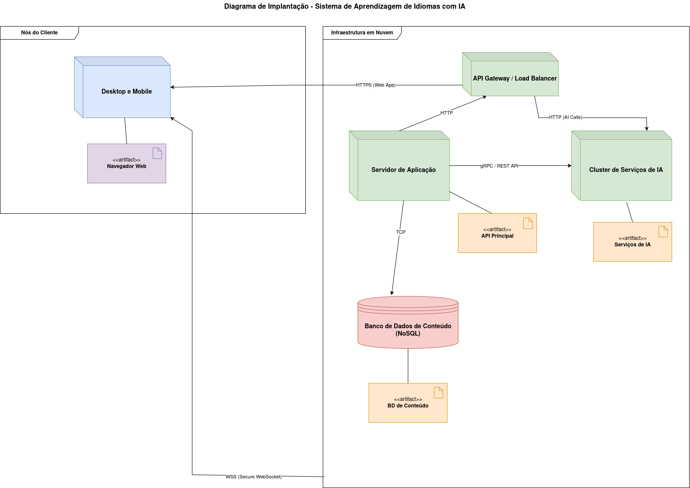

# Diagrama de Implantação

---

## Sumário
- [Técnica Utilizada](#técnica-utilizada)
- [Objetivos](#objetivos)
- [Bibliografia](#bibliografia)
- [Histórico de Versões](#histórico-de-versões)

---

## Técnica Utilizada

Segundo __Martin Fowler__, em seu livro __UML Essencial: Um Breve Guia para a Linguagem-Padrão de Modelagem de Objetos__, o diagrama de implantação mostra o layout físico de um sistema. Sua principal função é revelar quais componentes de software são executados em quais peças de hardware.

Para a construção do diagrama proposto foram utilizados dados referentes aos [requisitos funcionais e não funcionais da Entrega 1](https://unbarqdsw2025-2-turma02.github.io/2025.2_T02_G3_AprendendoComIA_Entrega_01/#/iniciativasExtras/requisitosElicitados) para identificação e modelagem inicial dos nós e mapeamento das dependências de artefatos.

---

Fonte: [Letícia Monteiro](https://github.com/LeticiaMonteiroo), [Samuel Santos](https://github.com/SamuelAfons), [Luiz Soares](https://github.com/luizh-gsoares) e [Vitor Bessa](https://github.com/Bessazs) 2025.

## Objetivos

A elicitação do diagrama visa ilustrar a configuração física e de rede de sistemas complexos e distribuídos, facilitando o entendimento, a comunicação e o gerenciamento da infraestrutura necessária para a operação do sistema.

---

## Bibliografia

> 1. WIKIPEDIA. [Duolingo](https://en.wikipedia.org/wiki/Duolingo). Acesso em: 21 set. 2025.
> 2. BABBEL. [Site Oficial](https://www.babbel.com/). Acesso em: 21 set. 2025.
> 3. ELSA. [ELSA Speak – Site Oficial](https://elsaspeak.com/en/). Acesso em: 21 set. 2025.
> 4. LANGUAGE IN INDIA. [Comparative Study](https://www.languageinindia.com/oct2024/drsunandauseAIEnglishlearning1.pdf). Acesso em: 21 set. 2025.
> 5. SCIEDUPRESS. [Teaching with Apps](https://www.sciedupress.com/journal/index.php/jct/article/download/25589/16050). Acesso em: 21 set. 2025.
> 6. ARXIV. [Gamification Misuse](https://arxiv.org/abs/2203.16175). Acesso em: 21 set. 2025.
> 7. IEEE. [SWEBOK](https://www.computer.org/education/bodies-of-knowledge/software-engineering). Acesso em: 21 set. 2025.
> 8. GOV.BR. [LGPD](https://www.gov.br/cidadania/pt-br/acesso-a-informacao/lgpd). Acesso em: 21 set. 2025.
> 9. SOMMERVILLE, Ian. [Engenharia de Software](https://www.pearson.com/en-us/subject-catalog/p/software-engineering/P200000003546/9780137035151). Acesso em: 21 set. 2025.
> 10. MIRO. [Arquitetura G3](https://miro.com/). Acesso em: 21 set. 2025.
> 11. GOOGLE FORMS. [Público Alvo](https://forms.gle/cB4qXso3j3tm2LVh6). Acesso em: 21 set. 2025.
> 12. FOWLER, M.; TORTELLO, J. **UML essencial: um breve guia para a linguagem-padrão de modelagem de objetos**. Porto Alegre: Bookman, 2005.

---

## Histórico de Versões

| Versão | Descrição | Autor(es) | Data de Produção | Revisor(es) | Data de Revisão | Incremento do Revisor |
| :----: | --------- | --------- | :--------------: | ----------- | :-------------: | :-------------------: |
| `1.0`  | Modelagem inicial | [Felipe das Neves](https://github.com/FelipeFreire-gf) | 12/09/2025 | [Samuel Afonso da Silva Santos](https://github.com/SamuelAfonso) | 21/09/2025| Descrição de Técnica Utilizada e Objetivos, Revisão do Diagrama |
| `1.1`  | Adição do Diagrama e Revisão dos Textos | [Letícia Monteiro](https://github.com/LeticiaMonteiroo) | 21/09/2025 | | | |
